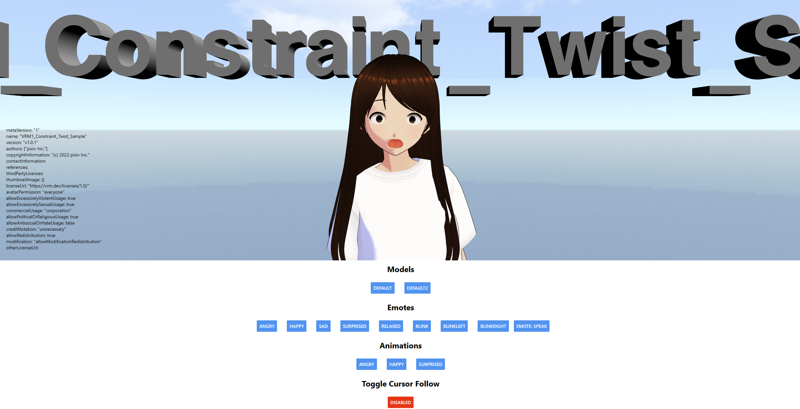

# VRM React Native - Proof of Concept

## Overview
A demo app that demonstrates how vrm models can be loaded in React Native. This is basically a test run before implementing into a larger project.

### Main Libraries
- [three.js](https://threejs.org/)
- [three-vrm](https://github.com/pixiv/three-vrm)
- [expo-gl](https://docs.expo.dev/versions/latest/sdk/gl-view/)
- [expo-three](https://github.com/expo/expo-three)

[expo-document-picker]() can be used for loading models on mobile (as well as web). May add this to the demo later. Currently, models are added by drag/drop

## Platforms (RN 0.71.4)
### Web
Runs great with no issues - as expected.

### Android
Will receive app breaking errors without manually patching React Native. After patching, there will be issues with loading the model (blob). I have listed some possible fixes below.
#### Potential Fixes
1. Changes to RN itself [#36332](https://github.com/facebook/react-native/pull/36332)
2. I think [react-native-blob-jsi-helper](https://github.com/mrousavy/react-native-blob-jsi-helper) is needed but doesn't seem to work with RN 0.71+: [possible fix](https://github.com/mrousavy/react-native-blob-jsi-helper/pull/11/commits/b228c36c27a85848c6c09fc4585c952c2d6e54ea)

### iOS
I don't own a Mac so I am unable to test.